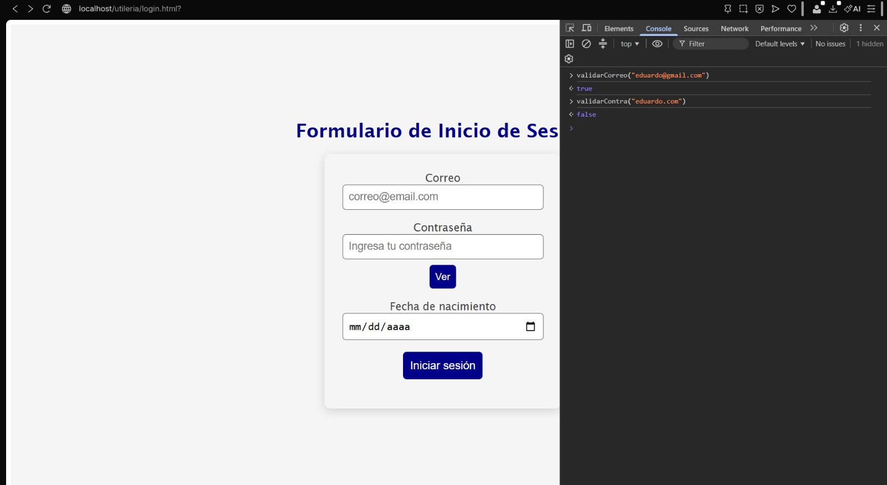
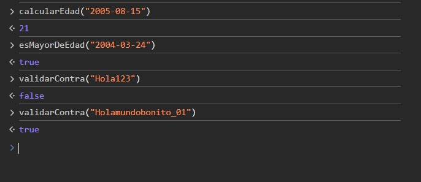
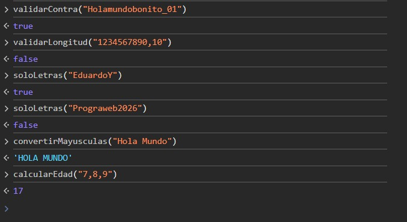

# Librería Utilería JS

## Autor

Eduardo Yael Mendoza Martinez
## Descripción

Esta librería contiene diferentes funciones utilitarias creadas en JavaScript para realizar validaciones, cálculos y conversiones de texto.

La librería fue hecha para facilitar algunas tareas comunes dentro de formularios y páginas web.

## Funciones

### 1. validarCorreo(correo)

Valida que un correo electrónico tenga un formato correcto.

**Parámetro:**
- `correo`: texto que contiene el correo electrónico.

**Retorna:**
- `true` si el correo es válido.
- `false` si el correo no es válido.

**Ejemplo:**

```js
validarCorreo("ejemplo@gmail.com");
### 2. soloLetras(texto)

Valida que un texto solamente contenga letras y espacios. También acepta letras con acentos.

**Parámetro:**

- `texto`: texto que se desea validar.

**Retorna:**

- `true` si solamente contiene letras.
- `false` si contiene otros caracteres.

**Ejemplo:**

```js
soloLetras("Eduardo");
### 3. validarLongitud(numero, maxLongitud)

Valida que un número no supere una cantidad máxima de caracteres.

**Parámetros:**

- `numero`: número que se desea validar.
- `maxLongitud`: cantidad máxima de caracteres permitidos.

**Retorna:**

- `true` si cumple con la longitud.
- `false` si supera la longitud máxima.

**Ejemplo:**

```js
validarLongitud(1234567890, 10);
### 4. calcularEdad(fechaNacimiento)

Calcula la edad de una persona utilizando su fecha de nacimiento.

**Parámetro:**

- `fechaNacimiento`: fecha de nacimiento de la persona.

**Retorna:**

- La edad calculada como número entero.

**Ejemplo:**

```js
calcularEdad("2005-08-15");
### 5. esMayorDeEdad(fechaNacimiento)

Valida si una persona tiene 18 años o más.

**Parámetro:**

- `fechaNacimiento`: fecha de nacimiento de la persona.

**Retorna:**

- `true` si es mayor de edad.
- `false` si es menor de edad.

**Ejemplo:**

```js
esMayorDeEdad("2005-08-15");
### 6. validarContra(contrasena)

Valida que una contraseña cumpla con los requisitos establecidos.

La contraseña debe tener mínimo 8 caracteres, una mayúscula, una minúscula, un número y un carácter especial.

**Parámetro:**

- `contrasena`: contraseña que se desea validar.

**Retorna:**

- `true` si cumple con los requisitos.
- `false` si no los cumple.

**Ejemplo:**

```js
validarContra("Hola123!");
## Funciones propias

### 7. convertirMayusculas(texto)

Convierte un texto completo a letras mayúsculas.

**Parámetro:**

- `texto`: texto que se desea convertir.

**Retorna:**

- El texto convertido a mayúsculas.

**Ejemplo:**

```js
convertirMayusculas("hola mundo");
### 8. calcularPromedio(numeros)

Calcula el promedio de varios números.

**Parámetro:**

- `numeros`: arreglo que contiene los números.

**Retorna:**

- El promedio de los números.

**Ejemplo:**

```js
calcularPromedio([8, 9, 10]);
## Instalación

Para utilizar la librería se debe incluir el archivo `utileria.js` en el documento HTML.

**Ejemplo:**

```html
<script src="js/utileria.js"></script>

### 2. Uso
Un ejemplo sencillo de cómo utilizar una función:

```markdown
## Uso

Las funciones pueden utilizarse desde JavaScript después de incluir la librería.

**Ejemplo:**

```js
var resultado = validarCorreo("ejemplo@gmail.com");

console.log(resultado);

### 3. Integración

```markdown
## Integración

La librería fue integrada en un formulario de inicio de sesión.

El formulario utiliza las funciones `validarCorreo()`, `validarContra()` y `esMayorDeEdad()` para validar los datos del usuario.

Cuando los datos son correctos, el usuario es enviado a la página de bienvenida.
## Evidencias de Funciones (Consola)



